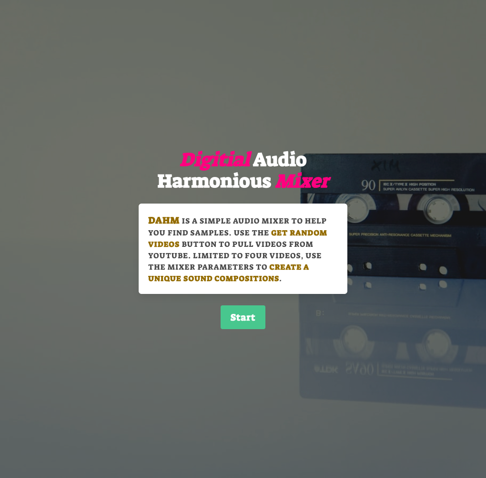
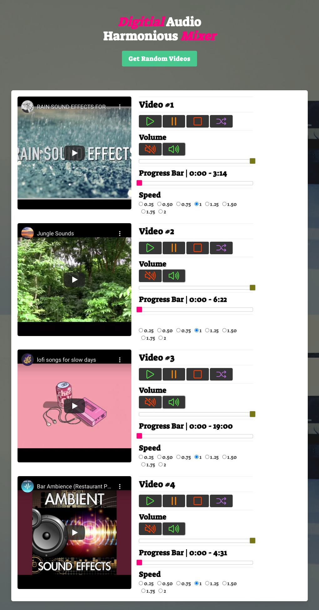

Project 1: Digital Audio Harmonious Mixer [DAHM]

Team Members: Allie Soliz, Derrick Bueno, Hashim Malik, Mehdi Mehrabani

## Project Requirements

1. Must use at least two server-side APIs

The two server-side API’s we chose for this project were the YouTube API & Words API. See below for links.

YouTube API Link [Let users watch, find, and manage YouTube content](https://developers.google.com/youtube)

Words API [An API for the English Language](https://www.wordsapi.com/)

2. Must use a CSS framework other than Bootstap

The CSS framework we chose for this project was Bulma. Working with Bulma turned out to be easy and less intimidating than initially thought. Visiting their github page, we were able to git clone their sample template file to utilize through out the process of designing our app. See below link.

Bulma Website [Bulma: the modern CSS framework that just works](https://bulma.io/)

Bulma Github Page [BulmaTemplates]]( https://github.com/BulmaTemplates/bulma-templates)

3. Must use client-side storage to store persistent data

Each time user clicks on the “Get Random Videos”, each video id that gets generated is saved in local storage. The purpose of this was to allow users to shuffle through these saved video id’s and to increase user interaction. The more videos a person is able to accumulate, the more opportunity to create unique sounds.

# DAHM: Summary

For our first Bootcamp project, we decided to create a unique audio mixer. DAHM is unique in that it allows users to import randomly generated YouTube videos and with a few mixer parameters, create an entire musical composition. See below for mixer parameters.

## DAHM: Mixer Parameters

- Buttons

1. Play – Play Video
2. Pause – To Pause Video
3. Stop – To Restart Video
4. Shuffle – To Shuffle Playlist
   a. Please note, the playlist is based on local storage. When user opens app for the first time, there are no videos saved. Local storage / playlist will only be populated after user as clicked on “Get Random Video”.

- Sliders

1. Volume – To adjust audio volume
2. Progress Bar – To adjust video playback location

- Sliders

1. Speed – To change the rate of video playback

DAHM: How To Operate

When user opens the app for the first time, they are be presented with a landing page. The landing page provides a short summary DAHM and allows user to enter the app with a Start button. See images at the end of this document.

When user clicks on the Start button, the mixer page will appear. This is the main page and where users will be able to interact with the app to create their sounds.

As a starting point, we collected four videos that showcase what this app can do.

1. Video 1 – Rain Sound Effect
2. Video 2 – Jungle Sounds
3. Video 3 – Lofi Sounds
4. Video 4 – Bar Sounds

Users are given the opportunity to play around with these four videos to understand the basics of how to manipulate the volume, speed to create sound. Once user is comfortable, they can venture off into playing with randomly generated videos

At the top of the mixer page, you will notice a Get Random Button. Upon user click, each video will be updated based on a randomly generated word. See below image of mixer page.

## File Structure

1. File: Index.html
2. File: README.md
3. Folder: Assets

   a. Folder: css

   - style.css

   b. Folder: js

   - script.js

   c. Folder: img

   - DAHM-Landing.png
   - DAHM-Mixer.png

## Process of Writing Code

Majority of the code was written in pure Javascript, with the exception to the volume and progress bar sliders.

The progress bar represents the live location of where the video is in relation to the duration of the video. If the user clicks on the Stop button, the video will restart to time 0:00 and will not start until user presses on play again. In these instances, when using pure Javascript, every time user clicked on the stop button, the reset value would default to 50% of the video duration. Speaking to our instructor for advice, we were advised to give JQuery a try and through research we were able to manually set the value to the correct position upon user click.

### YouTube API

There are two parts to working with YouTube API. The first is how to play YouTube videos and the other is how to search for videos.

#### YouTube IFrame Player API: Embedding Videos

The IFrame API allows developers to use simple code to control how they want to interact with videos on their website. See below summary provided by YouTube on the IFrame player API:

> " The IFrame player API lets you embed a YouTube video player on your website and control the player using JavaScript.

Using the API's JavaScript functions, you can queue videos for playback; play, pause, or stop those videos; adjust the player volume; or retrieve information about the video being played. You can also add event listeners that will execute in response to certain player events, such as a player state change."

By visiting the URL link below, you will see examples provided by YouTube on how to properly embed the `<script>` into the html and how to target each control parameter.

Youtube IFrame Player API [YouTube Player API Reference for iframe Embeds](https://developers.google.com/youtube/iframe_api_reference)

Please note we did not need to use any API key to interact with this functionality. See below explanation per MDN Web Docs and link to full page.

> "The <iframe> HTML element represents a nested browsing context, embedding another HTML page into the current one."

[<iframe>: The Inline Frame element](https://developer.mozilla.org/en-US/docs/Web/HTML/Element/iframe)

In summary, to control any video, we simply used the below to target the video id. Since we were using four videos, we used event listeners to identify which player to target.

- To Play: `player.playVideo()`
- To Pause: `player. pauseVideo()`
- To Stop: `player.stopVideo()”
- To Mute: `player. mute()`
- To Unmute: `player.unMute()`
- To Change Playback Speed: `player.setPlaybackRate()`
- To Change Time: `player.seekTo()`
- To Change Volume: `.setVolume()`

#### YouTube Data API v3: Searching Videos

The searching of YouTube videos requires using an API key. To generate a proper key, we used Google Cloud Platform to create a project which provided us an API Key for YouTube Data API v3.

Similarly, to using the Bulma Github page to git clone sample templates, we visited the YouTube Github page and found sample code as a starting point.

YouTube Github [YouTube API Samples](https://github.com/youtube/api-samples)

In addition, YouTube provides detailed explanations for essentially anything you need. See below two links.

YouTube API Getting Started [YouTube Data API Overview](https://developers.google.com/youtube/v3/getting-started)

YouTube Search List [Search: list](https://developers.google.com/youtube/v3/docs/search/list)

### Words API

For the second API requirement, we used Words API. Similarly to how Google handles the API key for YouTube, per Words API documentation page, in order to access their API we would have to create an account on RapidAPI.

Words API [Documentation](https://www.wordsapi.com/docs/)

Rapid API [Home Page](https://rapidapi.com/hub)

Both Words API and Rapid API provided very easy sample code to perform API calls to their database. Once we created an account on Rapid API, the sample code for calling on a random word was readily available.

## Logic For Code

The logic behind how the video search is done is by calling on Words API to provide a random word. Once the response to their API is verified to be ok, we would then use the word to search for a video on YouTube and retrieve the video id. When both calls are complete, the video id will be saved in Local storage and video players nested in `function onYouTubeIframeAPIReady()` would be updated.

Summary of Steps Below:

1. Created a ` for loop` inside a `addEventListener()` to call on both APIs four times for each click on the Get Random Button.

## Error Handling

There are essentially two main errors we wanted to handle. The first is the YouTube Quota limitations per API key. If the user hits this Quota, a Error #403 gets displayed in console indicating that the API call limit has been reached for the day. In this instance, the Get Random Button will be disabled and a message will appear to let user know that the daily quota has been met.

The second error is related to video ID’s that result in “Video Not Available”. In these instances, we created a function to delete the video ID upon receiving this error and to generate a new video ID.

# Final Project Images

## Landing Page

## Mixer Page

